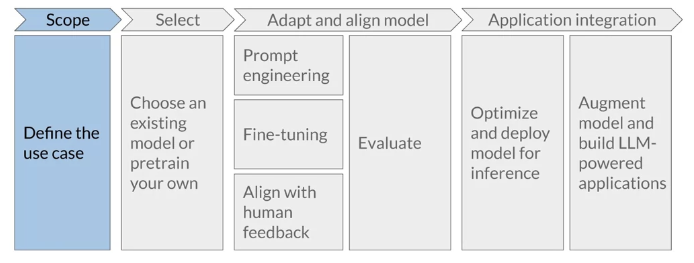

# Generative AI with Large Language Models

## Week 1. Generative AI use cases, project lifecycle, and model pre-training

### Generative configuration

Imagine we have a trained Large Language Model (LLM) that is used to complete a
sentence about food. We provide it with the prompt "My favorite fruit is..."

1. **Max New Tokens:** This is akin to determining how long we want the model's
   response to be. For instance, if we set Max New Tokens to 5, we're telling
   the model to provide a response that is no longer than 5 tokens. An output
   might be "an apple from New York."

2. **Greedy Decoding vs Random Sampling:** In Greedy Decoding, the model picks
   the next word with the highest probability. So, if the word 'apple' had the
   highest probability following our prompt, the model would select 'apple.' In
   contrast, with Random Sampling, the model might pick a less probable but
   still possible word, like 'mango.' So, our sentence might become "My favorite
   fruit is a mango..."

3. **Top-k and Top-p Sampling:** These are techniques to introduce some
   variability but not too much. Top-k sampling tells the model to only consider
   the top 'k' most probable next words. So, if k=3, and the top three probable
   words are 'apple,' 'mango,' and 'banana,' the model will randomly pick from
   these three. With Top-p sampling, the model considers the smallest set of
   words whose combined probability exceeds 'p'. So, if p=0.6, it will keep
   adding the most probable words until the combined probability is over 0.6,
   then randomly select the next word from this subset.

4. **Temperature:** This determines the level of randomness. A lower temperature
   (e.g., 0.1) would cause the model to select safer, more probable words. With
   our food prompt, this could result in "My favorite fruit is an apple,"
   because 'apple' is a common favorite fruit. A higher temperature (e.g., 2)
   would lead the model to generate more creative and varied outputs. It might
   result in "My favorite fruit is a kumquat," as it encourages the model to
   make more surprising word choices.

By manipulating these parameters, you can control the creativity, length, and
variety of the model's outputs.

### Generative AI project lifecycle

This video content explains the life cycle of developing and deploying an LLM (Large Language Model) powered application. The steps and considerations involved in this process are summarized in detail as follows:

1. **Scope Definition:** This is the initial and crucial step where the project's scope is accurately and narrowly defined. The function of the LLM in the application, the task it needs to perform, and its degree of capability should be determined. If the task is specific like named entity recognition, the model only needs to excel in that area. Being very specific about the model's required tasks can save both time and computing cost.

2. **Model Selection:** After defining the project's scope, the decision of whether to train a new model from scratch or utilize an existing one needs to be made. Generally, an existing model is chosen, but in certain cases, it might be necessary to train a new model. The feasibility of training a model will be discussed later in the course.

3. **Model Assessment and Additional Training:** The chosen model needs to be assessed for performance. If required, additional training could be applied. Prompt engineering or in-context learning using task-specific examples is initially tried to enhance model performance. If the model doesn't perform adequately, fine-tuning is attempted. This supervised learning process will be discussed in detail in the second week of the course.

4. **Aligning Model Behavior:** As models become more sophisticated, it's increasingly important to ensure they act in alignment with human preferences. A fine-tuning method known as reinforcement learning with human feedback can help ensure this alignment. This technique will be explored in detail in the third week of the course.

5. **Evaluation:** Assessing the model’s performance or alignment is a significant part of all these techniques. Various metrics and benchmarks can be used for this evaluation process.

6. **Deployment:** Once the model's performance needs are met and it's well-aligned, it's ready for deployment. The model is then integrated into the infrastructure and connected with the application.

7. **Optimization:** Post-deployment, the model should be optimized to ensure efficient use of compute resources and to provide the best user experience.

8. **Additional Infrastructure:** It's important to address any fundamental limitations of LLMs, such as their tendency to fabricate information or their limited ability to carry out complex reasoning. Certain techniques can be used to overcome these limitations, which will be explored towards the end of the course.

Throughout the course, the learners will revisit these stages repeatedly as they delve into the specifics of each step.
